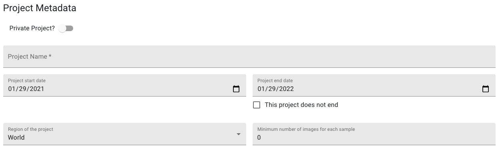

# Geofairy Management App

_Author: Zhiqi Yu_  
_Last update: 1/27/2021_

- [Geofairy Management App](#geofairy-management-app)
  - [1. Typical usage of the app](#1-typical-usage-of-the-app)
  - [2. User Interfaces](#2-user-interfaces)
    - [2.1. Header](#21-header)
    - [2.2. Pages](#22-pages)
      - [2.2.1. Homepage](#221-homepage)
      - [2.2.2. About page](#222-about-page)
      - [2.2.3. Login page](#223-login-page)
      - [2.2.4. Signup page](#224-signup-page)
      - [2.2.5. Project page](#225-project-page)
      - [2.2.6. Create/Edit project page](#226-createedit-project-page)
        - [Project Metadata](#project-metadata)
        - [Project Personnel](#project-personnel)
        - [Ground Truth Form Customization](#ground-truth-form-customization)
        - [Submit/Clear](#submitclear)
      - [2.2.7. Manage User page](#227-manage-user-page)
      - [2.2.8. Message page](#228-message-page)
  - [Appendix](#appendix)
    - [Roles of users](#roles-of-users)
    - [Public vs. Private projects](#public-vs-private-projects)

## 1. Typical usage of the app

Here is the typical flow of how an user may use this app:

1. Open the app.
2. Log in or sign up and then log in with the user's credentials.
3. Once logged in successfully, the user can navigate the app by clicking the navigation links in the app header.
4. Users can go to the `Projects` page, and view/create/modify projects depending on the user's role.

Next, a breakdown of the User Interfaces and their functions are shown.

## 2. User Interfaces

The Geofairy Project Management Portal consists of a header for navigation and the main container to show contents, as shown in the figure below.

### 2.1. Header

When the app is first loaded, the header consists of:

- `Title of the app`, which also redirect to homepage from anywhere in the app.
- `Projects` navigation button, which is disabled by default and will become accessible once the user logs in. This link leads the user to the project page.
- `About` navigation button, which shows a brief introduction to this app and the Geofairy App.
- `Login` button, which leads users to the login page.

Once the user logs in, the header will change slightly. Specifically, once the user logs in through the login page, the `Login` button will change to a user icon button as shown in the figure below:

Clicking on the icon will show a context menu for the logged-in user, as an example below:

The menu shows the username and the role of the logged-in user and three actions: `Update My Info`, `Messages`, and `Logout`.

The `Update My Info` button takes the user to the page to modify the name, password, etc. of the user.

The `Messages` button takes the user to the message board page that shows current messages received.

The `Logout` button logs the user out and takes the user back to the homepage.

### 2.2. Pages

#### 2.2.1. Homepage

Clicking on the title of the app shows the homepage. The homepage currently shows a brief introduction to the Geofairy App and this project management web application. More polished info will become available in the future.

#### 2.2.2. About page

Clicking on the `About` navigation button shows users with the about page. The about page currently shows the same information as home page, we will update the page in the future.

#### 2.2.3. Login page

Clicking the `Login` button when no user is logged in will take the user to the login page. 

The login page simply shows a login form that enables users to enter their username and password, and a link that conveniently leads new users to the [signup page](#224-signup-page) as shown in the red box in the image below:

Both username and password are **required**. Once users click `Submit`, a message box will be shown at bottom of the page to indicate whether the login is successful. 

<!-- If successful, the message box will look like this:

If failed, the message box will look like this:

 -->

#### 2.2.4. Signup page

The signup page can be accessed by clicking the `Don't have an account? Sign Up here` link in the [login page](#223-login-page).

The signup page shows a simple form for users to input information about the new account. The `Already have an account? Sign in here` link takes users back to the [login page](#223-login-page).

_**Notice: `username` is equivalent to the `email` of the user_  
_**Notice: **required** fields have an `*` appended to the field name_

If sucessfully signed up, the user will be taken to the [login page](#223-login-page) automatically.

#### 2.2.5. Project page

The project page can be accessed by clicking the `Projects` navigation button once the user logs in.

The project page shows basic info about all projects available on the server.

The project page consists of following elements:

- Public projects panel
  
  This panel shows a list of publicly available projects that can be accessed by any user. Each project can be expanded to show more info about the project as shown below:

   

- Private projects panel
  
  This panel list all private projects. Unlike public projects, private projects are only accessible by users that participate in the project. If the current user is participated in a private project, the project will show a `joined` tag as shown below:

  

  If the current user is the creator of a private project, the project will show a `created` tag as shown below:

  

  _**Note: The creator joins a project by default._

  ---

  If a user wants to join a private project, he can expand the project, and click the `Request to join` button as shown below:

  

  This will send a request message to the project owner, who decides whether to approve the request.

  If a user already joined a project, the `Request to join` button will be disabled.

  ---

  If the current user is the creator of a private project, he can edit the project by clicking the `Edit project` button, which will lead the user to the [Create/Edit project page](#226-createedit-project-page).

  

- `Create a new project` button

  
  
  This button is only shown to users with **higher** than `USER` privilege. Clicking this button leads users to the [Create/Edit project page](#226-createedit-project-page)

  
#### 2.2.6. Create/Edit project page

This page serves two purposes, creating a new project or editing an existing project created by the current user. When creating a new project, all fields will be left blank. When editing an existing project, fields will be populated with info of this project.

The page mainly consists of three parts:

- [Project Metadata](#project-metadata)
- [Project Personnel](#project-personnel)
- [GroundTruth Form Customization](#ground-truth-form-customization)
- [Submit/Clear](#submitclear)

##### Project Metadata

This part include metadata about the project:

- `Private project?` switch it on if this project is not open to public.
- `Project Name` this should be the official name of the project. **Required**.
- `Project start date` this is the date when the project starts. Default is today.
- `Project end date` this is the date when the project ends. Default is one year from today. Check the `This project does not end` checkbox clears and disables this field.
- `Region of the project` the country-level region of the project. Default is `World`.
- `Minimum number of images per sample` this sets the minimum number of images required to be submitted for each ground truth sample. Default is 0.

##### Project Personnel

This part consists of:

- `Project Administrator (Creator)` this is username/email of the current user by default, and cannot be modified.
- `Principal Investigator (PI)` this should be the name of the PI of this project. **Required**.
- `PI's email` this should be the PI's email. **Required**.
- `Authorized users (username/email) who can access this project` this field is disabled when the project is for public. If the `Private project?` switch is turned on, this field will open for input. 
  
  _**Note: Emails should be entered in the field one by one. There is no validation, so please verify that each email is correct._   
  _**Note: The emails can be an email for a **registered** user, it can also be an **unregistered** user. Once the user with the unregistered email signs up, he will automatically have access to this project._  

##### Ground Truth Form Customization

This part list the fields of the ground truth samples for surveyors to fill in. A default list of fields are shown for each new project.

Users can customize the list of fields and each field: 

- To add a new field, the user can click the `Add a new field` below the list to add a blank field. 

  

  These attributes of the field should be specified:

  - `Field name` this is the name of this field. **required**.
  - `Field Type` this decides how this field is displayed on the Geofairy mobile app. These options can be selected:
    - `Text` use this for plain text field.
    - `Dropdown` use this for single selection among multiple options.
    - `Checkboxes` use this for selections among **a few** options.
    - `Radio Buttons` use this solely for boolean type field, i.e. true or false.
    - `Multiselect Dropdown` use this if options have multiple hierarchies, e.g. group1 -> [option1, option2 ...]. **Please limit usage of this type unless have to.**
  - `Data Type` this decides what data type to use for this field. Can be chosen from these options:
    - `String` a plain string.
    - `Integer` an integer number.
    - `Float` a floating number.
    - `Boolean` true/false, use it with `Radio Buttons`.
  - `Options to Include` only shows when the field type is selected as `Dropdown` or `Multiselect Dropdown`. This allows users to enter options for users to choose from for this field.

  - `This field is required to fill in?` a checkbox when checked means this field is required to fill before submition.

  After modifications are made to a field, the `Save` button should be clicked to save the updates. 

- To delete a field, click the `delete` button of the field.

##### Submit/Clear

This part consists of two buttons, `Submit` and `Clear`:

`Submit` submits this created/updated project. A message should pop up to show whether submission is successful.

`Clear` clears the form.

#### 2.2.7. Manage User page

This page is only accessible by users with `ROOT` level privilege.

The list of all users are shown in the list, and their roles can be modified by selecting from the list of roles. Only two roles can be choose from, i.e. `User` and `Project Administrator`.

#### 2.2.8. Message page

When a `ADMIN` or higher level user logs in, he/she can check if there are any pending request to join messages. This can be known by checking the user icon. If there are unresponded messages, the user icon will have a badge like this:

The message button will have a badge showing how many messages are pending:

The message page shows the list of all messages:

Each message shows which user request to join which project, and the user can choose to either `approve` or `Reject` the request. 

## Appendix

### Roles of users

- `USER` this role can only browse all projects, access and contribute to all public projects as well as private projects that he/she participates in.
- `ADMIN` this role can do everything a `USER` can do, plus create projects, both public and private, and add users to projects.
- `ROOT` this role can do everything a `ADMIN` can do, plus managing users, changing their roles.

### Public vs. Private projects

Public projects can be accessed by all registered user.

Private projects can only be accessed if the user is included in the user list by the project creator, or approved to join by the creator.

